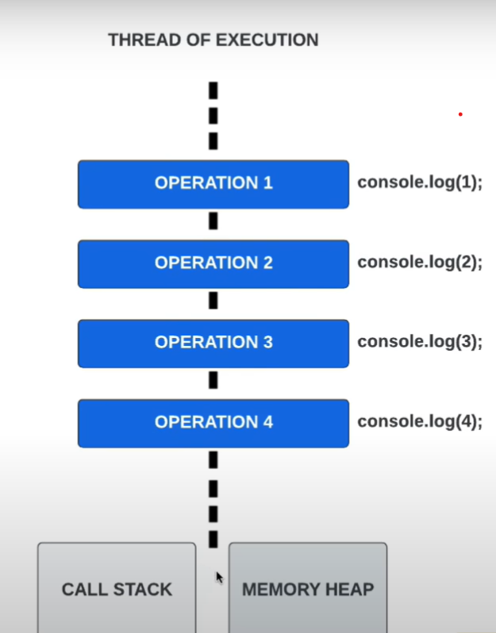
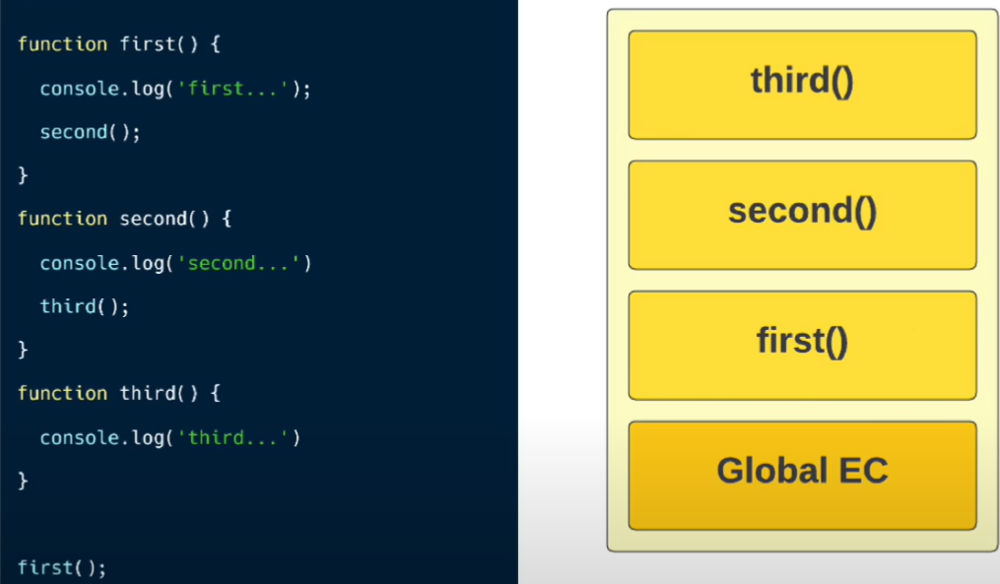

# The JavaScript
  JavaScript is a synchronous(blocking) single-threaded language
  It executes code one by one from top to bottom in a serial and sequential manner.
  And does not have multiple threads to execute code parallelly/concurrently.

  ## Thread of Execution
  A thread is a single sequential flow of control in a program.
  A thread has a call stack & memory.
  Everything in JavaScript happens line by line on a single thread.
  

  ## Call Stack
  Call stack keeps track of our functions that are executing.
  It manages the execution context.
  Stack follows *LIFO* Last In First Out.
  

# How our code is Executed
So, JavaScript is always hosted in some environment.
And that is most typically a browser such a Google Chrome, Firefox, Safari etc,this is where javaScript runs.
There can also be other hosts such as the NoJS web server.

So when we write our JavaScript code,and run it,there's a lot of stuff happening behind the scenes.So what happens is that the host where JavaScript is hosted, has some kind of JavaScript engine that takes our code and executes it.

## JavaScript Engine
So in very simple terms,a JavaScript engine is a program that executes JavaScript code.There are many different engines out there, like  Google's V8 engine, that is used in Google Chrome,SpiderMonkey, JavaScript core etc.

Now, the first thing that happens inside the engine,is that:
1. Our code is parsed by a parser, which basically reads our code line by line,and checks if    the syntax of the code that we gave it, is correct.So this means that the parser knows the JavaScript rules and how it has to be written in order to be correct and valid.And if you make some mistakes,it basically throws an error and stops the execution.
2. If everything is correct,then the parser produces a data structure known as the Abstract Syntax Tree,which is then translated into machine code.
So this code is no longer JavaScript code,but a code, or let's say a set of instructions,that can be executed directly by the computer's processor.And it's only when our code already converted to a machine code, actually runs and does its work.

## Execution Context
When you run any JavaScript, a special environment is created(because all JavaScript code needs an environment to run) to handle the transformation & execution of code. This is called the `Execution Context`.It contains the currently running code and everything that aids in its execution.

Execution Contexts allow the JavaScript engine to manage the complexity of interpreting & running your code 

Execution Context can be imagined as a box,a container or a wrapper which stores variables and in which a piece of our code is evaluated and executed.

there are two types of execution context:
1. Global Execution Context
2. Function Execution Context(for every function invoked)

The first execution context that gets created when the JavaScript engine runs the code/script is called `global execution context`.
The default context is the global execution context.

JavaScript program is executed in 2 PHASES inside Execution Context:
1. Memory Creation Phase
  - In this the global object is created(browser = window, Node.js = global)
  - The `this` object is created and bind it to the global object.
  - Memory Heap is setup for storing variables and function references
  - Functions and variables are stored in global execution context and set to `undefined`.
2. Execution Phase
  - Code is executed line by line
  - And a new execution context is created for each function call/invocation

## Hoisting
Hoisting is often referred to as the process where the interpreter appears to move the declaration of functions and variables to the top of their scope prior to the execution of code.
But this is a misleading statement.  
Actually hoisting is the process or phenomenon of assigning a variable declaration a default value of `undefined` during the Creation Phase.
