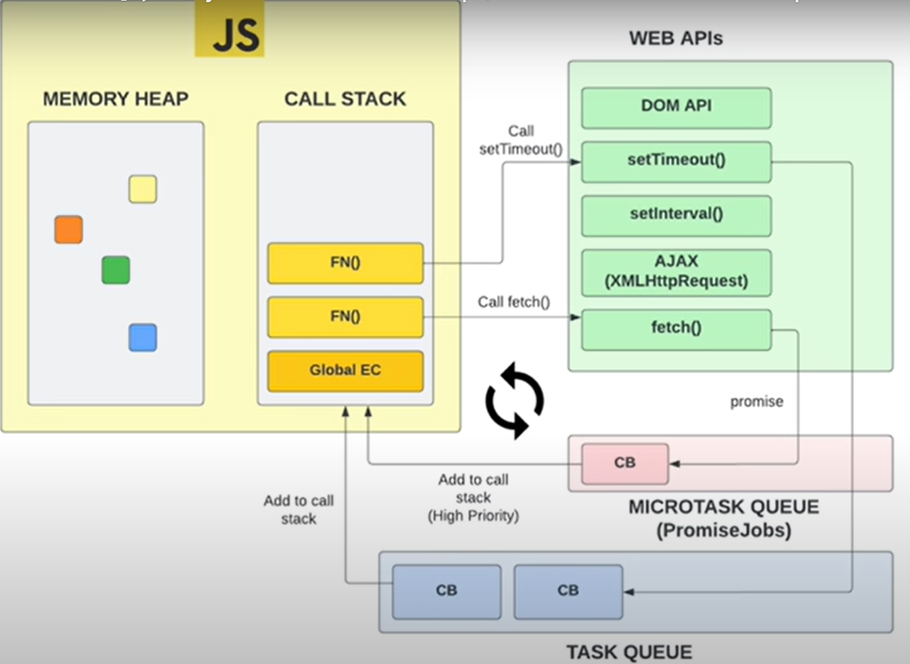

# Event Loop
In JavaScript,An event loop is a control flow mechanism that continuously checks and manages the processing of events and react to them as they happen, an event loop is a fundamental concept that governs the execution of code, particularly when dealing with asynchronous operations. It is an essential part of the JavaScript runtime environment, which allows non-blocking, concurrent execution of code.

 

Here's a simplified explanation of how the event loop works in JavaScript:

*Call Stack*: JavaScript maintains a call stack, which is a data structure that keeps track of the function calls currently being executed. When a function is called, it's pushed onto the stack, and when it's done executing, it's popped off the stack.

*Callback Queue*: Asynchronous operations in JavaScript, such as timers, network requests, and user interactions, are handled using callback functions. When an asynchronous operation is completed, its callback function is placed in a callback queue (also known as the task queue or message queue).

*Event Loop*: The event loop is a continuous process that checks the call stack and the callback queue. It does the following:

a. If the call stack is empty, it takes the first function from the callback queue and pushes it onto the call stack for execution.

b. If the call stack is not empty, it continues to process functions from the call stack, and the event loop will wait until the call stack is empty before picking up items from the callback queue.

This mechanism ensures that asynchronous operations do not block the main thread of execution. It allows JavaScript to handle multiple tasks concurrently, making it suitable for tasks like handling user interactions, animations, and network requests without freezing the application.

The event loop is a crucial part of JavaScript's single-threaded, non-blocking, and event-driven nature. It enables the development of responsive and efficient web applications by managing the execution of code in a way that prevents long-running or blocking operations from disrupting the user interface.

